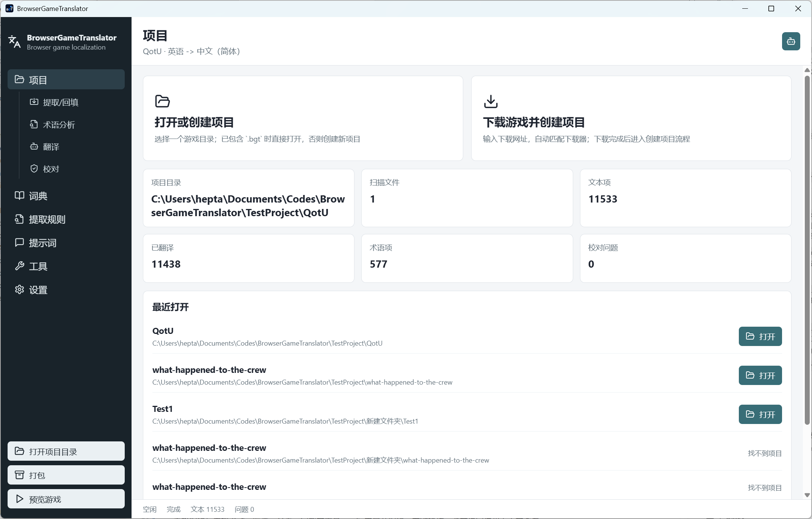
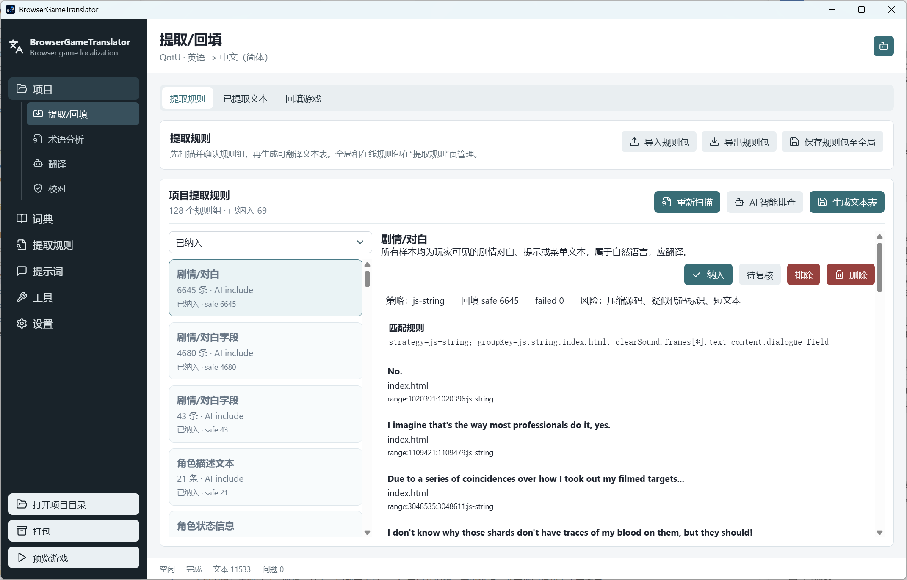
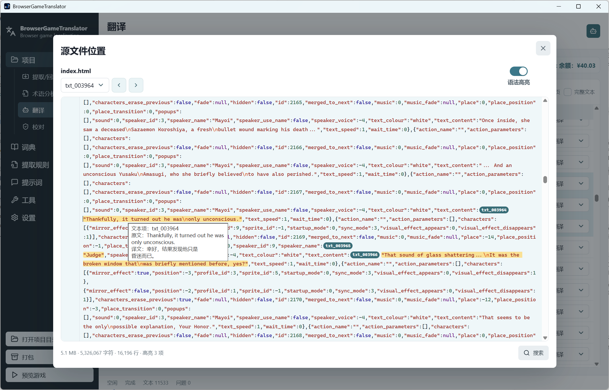
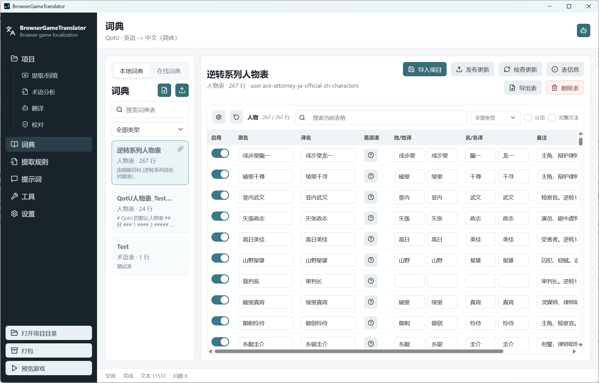
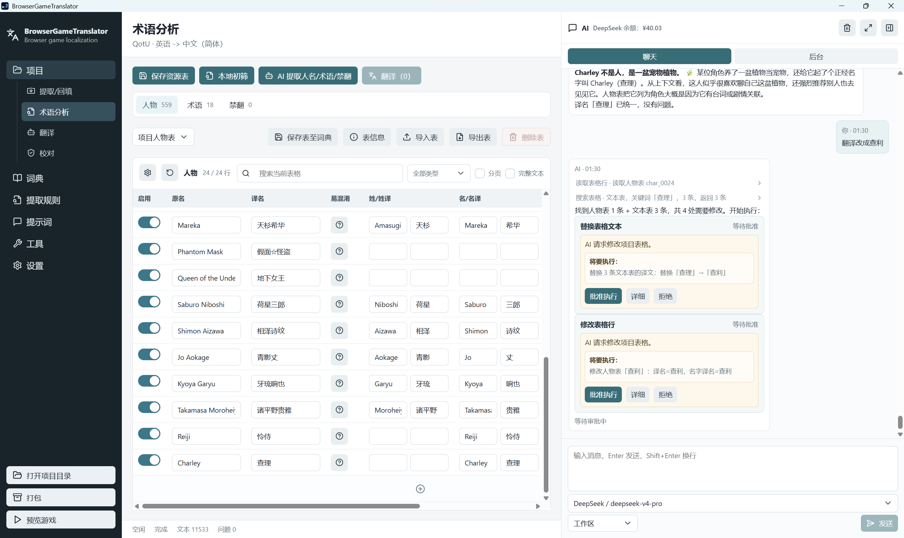
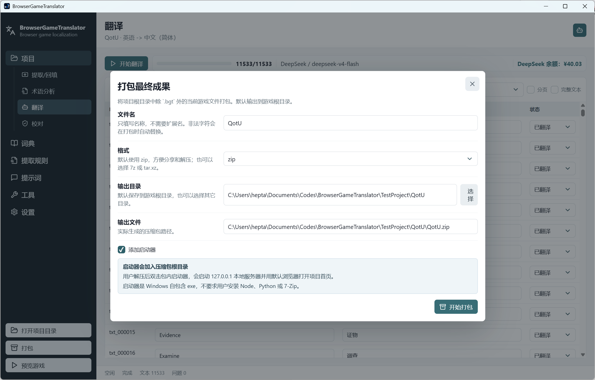

# BrowserGameTranslator

BrowserGameTranslator 是一个面向离线网页游戏的桌面本地化工作台。它用于处理已经下载到本地的 HTML、JavaScript、JSON、CSV、文本等网页游戏资源，提供智能提取规则、文本表格编辑、词典管理、AI 翻译、AI 校对、AI agent 辅助、写回、预览和打包流程。

项目当前处于发布前稳定化阶段：主功能链路已经成型，适合自用和小范围试用；正式发布前仍需要更多真实项目全流程验证。

## 项目亮点

- 智能提取规则：先生成候选文本和规则组，再由 AI 辅助排查，用户确认规则后生成正式文本表，减少误提取污染后续翻译。
- 可复用词典体系：人物表、术语表、禁翻表可以在项目、全局词典和在线词典之间流转，适合系列作品或多人协作。
- 可审批的 AI agent：右侧 AI 面板可以查询表格、修改资源、搜索网页和提取网页内容；写操作进入审批流程，并支持 diff 查看和部分批准。
- 源文件定位与上下文查看：表格行可直接跳转到 `.bgt/original` 中的源文件位置，也能查看原始完整表的前后文。
- 安全写回与可交付打包：写回始终以 original 快照为基线重建，打包时可附带轻量 Windows 启动器，让翻译后的网页游戏直接离线运行。

## 截图

### 项目工作台



项目打开后的主界面，展示左侧项目导航、文本表格和右侧 AI 面板入口。

### 智能提取规则



提取/回填页的规则组确认流程，展示扫描结果、AI 建议、规则决策和生成文本表入口。

### 表格编辑与源文件定位



展示翻译文本表、行内编辑、右键菜单，以及源文件位置弹窗中的 CodeMirror 高亮。

### 词典与在线词典



展示全局词典/在线词典列表、资源表格和导入项目、导出、投稿等操作。

### AI Agent 审批



展示右侧 AI 面板、工具调用灰字、审批卡片，以及 diff 详情中的部分批准能力。

### 打包与交付



展示打包弹窗，突出格式选择、输出目录、启动器选项和最终交付流程。

## 功能概览

- 项目管理：创建或打开网页游戏翻译项目，项目数据保存在游戏目录下的 `.bgt`。
- 提取/回填：从项目文件生成文本表，支持导入导出，并从 `.bgt/original` 基线安全写回游戏目录。
- 表格编辑：虚拟滚动、筛选、分页、完整文本显示、行内展开编辑、右键操作、源文件定位和上下文查看。
- 术语分析：维护人物表、术语表、禁翻表，支持 AI 分析和人工编辑。
- 词典：支持全局词典、项目词典、在线词典，人物/术语/禁翻表可以导入、导出、应用到项目和投稿到 GitHub Discussions。
- 翻译：调用 DeepSeek 或 OpenAI 兼容接口进行批量翻译，支持进度显示、模型显示和 DeepSeek 余额显示。
- 校对：支持语言检查、术语检查、规则检查和 AI 自动校对。
- AI agent：右侧聊天面板可读取项目表格、执行受控工具、搜索网页、提取网页内容，并通过审批 UI 管控表格/文件修改。
- 提示词配置：支持全局提示词和当前工作区提示词，工作区提示词优先。
- 工具页：支持通用 HTML5 网页游戏下载和 AAOnline 游戏下载。
- 预览：在项目根目录启动本地网页服务器，用外部浏览器打开项目首页。
- 打包：将当前翻译成果打包为 `zip`、`7z` 或 `tar.xz`，可选加入轻量 Windows 启动器。

## 使用流程

典型流程：

1. 打开或创建项目。
2. 在“提取/回填”页扫描项目，生成候选规则组。
3. 使用“AI 智能排查”辅助判断规则组。
4. 确认规则并生成正式文本表。
5. 在“术语分析”页维护人物、术语和禁翻项。
6. 在“翻译”页批量翻译。
7. 在“校对”页检查问题并修复。
8. 应用回游戏目录。
9. 预览游戏。
10. 打包发布。

## 工作区结构

创建项目后，游戏目录本身就是工作区和预览目录：

```text
游戏目录/
  index.html
  ...
  .bgt/
    .gitignore
    project.json
    original/
    extracted/
      text-items.jsonl
      scan-report.json
      extraction-candidates.jsonl
      extraction-rule-groups.json
      extraction-rules.json
      extraction-rule-ai-review.json
      extraction-rule-report.json
    resources/
      characters.jsonl
      glossary.jsonl
      no-translate.jsonl
    dictionaries/
      *.jsonl
    qa/
      issues.jsonl
    patches/
      patch-manifest.json
    logs/
      tasks.log
      ai-chat.jsonl
      ai-context.json
      agent-checkpoint.json
      agent-task-plan.json
    prompts.json
```

`.bgt/original` 保存创建项目时的原始副本。应用翻译时，程序会先从 `.bgt/original` 重建项目根目录中除 `.bgt` 外的文件，再把当前翻译表应用回工作区，避免在已经翻译过的文件上继续替换原文。

`.bgt/project.json` 只保存 `projectRoot`。写入文件时它通常是相对项目根目录的 `"."`，程序打开项目后会解析为本机绝对路径使用。

Provider 配置、模型、Base URL、API Key、GitHub token 和个人 AI 聊天日志属于本机数据，不适合同步进项目仓库。

## AI 与权限

AI 功能分为两类：

- 程序任务 AI：用于智能规则排查、术语分析、批量翻译、AI 校对等固定流程。
- 右侧 AI agent：用于聊天式辅助项目操作。

AI agent 支持三种权限模式：

- 受限：只允许项目表操作。
- 工作区：允许项目目录内文件访问和需要审批的 shell 请求。
- 无限制：允许任意路径访问和需要审批的 shell 请求。

表格新增、修改、替换、删除以及文件写入等高风险操作会进入审批 UI。审批详情支持 diff 预览和部分批准。

## 在线词典与在线规则

项目支持通过 GitHub Discussions 分享和获取：

- 在线词典：人物表、术语表、禁翻表。
- 在线提取规则包：适用于特定游戏、引擎或资源结构的提取规则。

相关 GitHub 仓库、分类和 token 在设置页配置，配置保存在本机。

## 项目结构

```text
src/
  main/          Electron 主进程、文件系统、AI、提取规则、词典、打包、预览等服务
  preload/       Renderer 与主进程之间的安全 API
  renderer/      React 界面
  shared/        前后端共享类型
resources/
  icon/          应用与启动器图标
  launcher/      内置 Windows 启动器
tools/
  launcher/      C/Win32 启动器源码
docs/
  screenshots/   README 截图
  internal/      本地设计草稿，不提交
```

## 开发环境

需要：

- Node.js
- npm
- Windows 环境
- C 编译环境，用于重新编译内置 Windows 启动器

安装依赖：

```powershell
npm install
```

开发运行：

```powershell
npm run dev
```

生产构建：

```powershell
npm run build
```

启动构建后的 Electron 应用：

```powershell
npm run start
```

类型检查：

```powershell
npm run typecheck
```

代码检查：

```powershell
npm run lint
npm run check:unused
```

## 打包

重新生成 Windows 图标：

```powershell
npm run build:icon
```

重新编译内置启动器：

```powershell
npm run build:launcher
```

生成 Windows 便携版 zip：

```powershell
npm run package:portable
```

这个命令会先构建应用、编译内置启动器，再生成 Windows 应用目录，并用 Velopack 打出可自更新的便携版包。

便携版输出到：

```text
release/velopack/BrowserGameTranslator-win-Portable.zip
```

发布到 GitHub Releases 时，需要同时上传 Velopack 更新所需资产：

```text
release/velopack/BrowserGameTranslator-win-Portable.zip
release/velopack/BrowserGameTranslator-0.1.0-full.nupkg
release/velopack/releases.win.json
release/velopack/assets.win.json
```

推荐用 Velopack CLI 发布到 GitHub Releases，避免漏传更新索引：

```powershell
npm run velopack:upload:github
```

这一步是发布者操作，需要本机具备该仓库的 Release 写权限；不影响普通用户检查和安装更新。

如果需要生成 delta 包，打包前先拉取远端最新 Velopack 资产：

```powershell
npm run velopack:download:github
npm run package:portable
npm run velopack:upload:github
```

检查更新依赖最新 Release 中的 `releases.win.json` 和对应 `.nupkg`。如果最新 Release 只有用户下载的 portable zip，应用内检查更新会失败。应用运行时不需要 GitHub token；公开仓库的 Release 资产必须可匿名读取。

## 图标与启动器

应用图标源文件：

```text
resources/icon/icon.png
```

启动器源码：

```text
tools/launcher/main.c
```

启动器是 C/Win32 实现，只依赖 Windows 系统 DLL。打包游戏时勾选“添加启动器”后，压缩包根目录会包含：

- 启动器 exe
- `BGT-Launcher.json`
- `README-启动说明.txt`

用户解压后双击启动器 exe，即可启动 `127.0.0.1` 本地服务器并用系统默认浏览器打开游戏。

## 注意事项

- 本工具面向已经合法下载到本地的网页游戏，不负责绕过 DRM、登录、付费或服务端资源限制。
- AI 请求会把待处理文本发送到用户配置的服务商，请在使用前确认文本和 Key 管理策略。
- 网页搜索和网页提取不会主动绕过 Cloudflare 等访问控制。
- 正式发布前建议用真实项目完整跑通扫描、规则确认、翻译、校对、写回、预览和打包。

## 致谢

特别感谢 [AiNiee](https://github.com/NEKOparapa/AiNiee)。本项目的翻译提示词、术语/禁翻表组织方式和部分校对规则参考了 AiNiee 的设计与实现。
